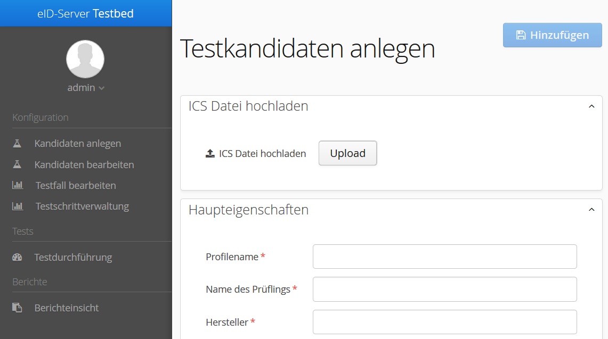

The information in this file may be outdated and is provided here just for reference.

eID-Server Testumgebung

Benutzerhandbuch

Einleitung
==========

Hintergrund und Motivation
--------------------------

Bei der Online-Authentisierung mit dem neuen Personalausweis bzw. dem
elektronischen Aufenthaltstitel benötigen Diensteanbieter (bzw. ein von
ihm beauftragter Dienstleister) einen eID-Server. Zugleich benötigt der
Inhaber eines solchen Ausweisdokuments einen eID-Client.

Der eID-Server, spezifiziert in der BSI [@TR-03130-1] und [@TR-03112],
übernimmt hierbei für den Diensteanbieter die sichere Kommunikation mit
der Client-Software des Ausweisinhabers inklusive dem Ausweischip und
gibt ausgelesene Daten an den Diensteanbieter weiter. Hierbei
verarbeitet der eID-Server Anfragen von Diensteanbietern, kommuniziert
mit eID-Clients und stellt die Authentizität und die Gültigkeit eines
Ausweises fest, bezieht Berechtigungszertifikate, prüft
Sperrinformationen und übermittelt seine Ergebnisse dann an die Systeme
des Diensteanbieters.

Um die Konformität von eID-Server-Implementierungen zu
der zugrundeliegenden Spezifikation und die Interoperabilität mit den
anderen Komponenten der eID-Infrastruktur (eID-Clients, Ausweischip,
Schnittstellen des Diensteanbieters) sicherzustellen, definiert das BSI
eine Reihe von Konformitätstests. Diese dienen als Grundlage für eine
TR-Zertifizierung von eID-Server und ermöglichen es Diensteanbietern
geeignete eID-Server einzusetzen und eID-Services zu beauftragen. Zudem
können die Tests auch von eID-Server-Herstellern bereits während der
Entwicklungsphase zur Qualitätssicherung verwendet werden. Sie geben
Aufschluss darüber, welches Verhalten des eID-Servers in bestimmten
Situationen erwartet wird.

Um die Konformitätsprüfungen in der Praxis durchführen zu können, wurde
ein Prüftool implementiert, welches die spezifizierten Testfälle
abdeckt. Mit dessen Hilfe lässt sich das Verhalten von eID-Servers
aufzeichnen und genau analysieren. Die Analyse erfolgt dabei
automatisch. Anhand von erzeugten Logdateien können aber alle Schritte
auch manuell verifiziert werden.

Besondere Beachtung findet dabei die einfache Anwendbarkeit der
Testumgebung sowie eine weitestgehende Automatisierung der Abläufe, von
der Testeinrichtung bis hin zur Testauswertung. Hierdurch wird eine
einfache und kontinuierliche Nutzung der Testumgebung gewährleistet, die
schon frühzeitig während der Entwicklungszeit eines eID-Servers
Auskünfte über seine Konformität zur Technischen Richtlinie
[@TR-03130-1] liefern kann.

Vorgehensweise und Referenzen
-----------------------------

Um eine eID-Server Testumgebung zu realisieren wurden die notwendigen
Anforderungen an eine solche Testumgebung erfasst und bewertet. Hierzu
wurden die Technischen Richtlinien des BSI

-   [@TR-03110] Advanced Security Mechanisms for Machine Readable Travel
    Documents
-   [@TR-03112] Das eCard-API-Framework
-   [@TR-03124-1] eID-Client
-   [@TR-03130-1] eID-Server

als Grundlage herangezogen. Neben den Technischen Richtlinien finden
auch weitere Quellen Beachtung. Hierzu zählen:

-   Anforderungen aus dem Betrieb einer zertifizierten Prüfstelle
-   Anforderungen aus dem Betrieb einer Testumgebung für
    entwicklungsbegleitende Testausführung
-   Entwicklung eines Testframeworks für eID-Clients

Als Ergebnis setzt das eID-Server Prüftool alle notwendigen
Anforderungen um und bietet dadurch ein universelles Werkzeug zur
Konformitätsfeststellung. In diesem Dokument wird die Installation und
Benutzung dieses Werkzeugs erläutert.

Ausgangssituation und Prüfumgebung
----------------------------------

Für den Betrieb eines eID-Servers ist es notwendig, die Konformität des
eID-Servers bezüglich der Anforderungen der Technischen Richtlinie
[@TR-03130-1] nachzuweisen. Hierzu wurde vom BSI die Technische
Richtlinie [@TR-03130-4] entwickelt, welche die notwendigen
Konformitätstests definiert und beschreibt. Zum Nachweis der Konformität
eines eID-Servers muss der Hersteller diesen einer Konformitätsprüfung
durch ein zertifiziertes Prüflabor unterziehen. Basierend auf den
Ergebnissen dieser Konformitätsprüfung entscheidet das BSI über die
Zertifizierung des eID-Server. Das Prüfszenario in einem zertifizierten
Prüflabor besteht im wesentlichen aus gerichteter Prüfung **einer**
eID-Server Instanz auf der Basis der in der [@TR-03130-4] definierten
Testfälle.

[Abbildung 2: Testaufbau im Prüflabor (vereinfachte
Darstellung)]{.image}

In der Abbildung ist schematisch ein Prüfszenario dargestellt. In diesem
Szenario muss das Prüflabor den zu prüfenden eID-Server bzw. Zugang dazu
sowie die dazugehörigen ICS Daten vom eID-Server Hersteller erhalten.
Der Prüfer führt in diesem Szenario folgende Schritte durch:

-   Konfiguration der eID-Server Testumgebung und des eID-Servers auf
    Basis der ICS Daten
-   Ausführung der Konformitätstests
-   Verifikation und Analyse der Testergebnisse
-   Erzeugung Testberichtes

### Durchführung von entwicklungsbegleitenden Tests

Neben der Konformitätsprüfung zur Erlangung einer Zertifizierung nach
[@TR-03130-4] kann es, aufgrund der Komplexität der zum Einsatz
kommenden Protokolle und Technologien, hilfreich sein schon während der
Entwicklungsarbeiten am eID-Server sein Verhalten zu analysieren. Diese
entwicklungsbegleitenden Testarbeiten ermöglichen es dem Hersteller
eines eID-Servers frühzeitig die Konformität zur [@TR-03130-1] zu
erreichen. Dies verringert die Testaufwände während einer
Konformitätsprüfung zur Zertifizierung und senkt somit Kosten. Weiterhin
sorgt eine frühzeitige Herstellung von Konformität aller beteiligten
Komponenten zur [@TR-03130-1] für eine problemlose Integration von
eID-Servern in Anwendungsszenarien und damit für eine höhere Akzeptanz
und Adaptionsrate der Technologie. Das im Folgenden exemplarisch
dargestellte Testszenario basiert auf Erfahrungen aus Durchführung von
Entwicklungsprojekten.

[Abbildung 3: Testaufbau für entwicklungsbegleitende Tests
(vereinfachte Darstellung)]{.image}

In diesem Szenario ist es möglich **mehrere**, **voneinander
unabhängige** eID-Server Instanzen zu testen. Dies ermöglicht es einem
eID-Server Hersteller die Tests kontinuierlich durchzuführen und somit
frühzeitig

a\) Fehler in der Implementierung zu erkennen und

b\) Konformität zur [@TR-03130-1] herzustellen

Weiterhin ist es in diesem Szenario möglich mehrere Testprofile in der
eID-Server Testumgebung zu hinterlegen, welche ja nach Art des Test
durchgeführt werden können. So ist es zum Beispiel möglich
Regressionstests zu definieren, welche zwar nicht vollumfänglich sind,
aber regelmäßig von den Entwicklern durchgeführt werden. Vollumfängliche
Tests hingegen werden vor einer Veröffentlichung der Software
durchgeführt.

Installation
============

Für die Installation der Prüfumgebung werden einige open-source
Komponenten verwendet, wie bspw. ein Application Server oder eine
Datenbank. Diese können aus dem Internet heruntergeladen werden. Die
anschließende Installation dieser Komponente wird in diesem Kapitel
beschrieben.

Schritte für die Inbetriebnahme des Testbeds:

1.  Oracle JDK 8 herunterladen und installieren.
2.  Java Cryptography Extensions für das JDK 8 herunterladen und
    installieren.
3.  Es wird Payara Server Full verwendet; dieser ist von
    http://www.payara.fish/downloads herunterzuladen. Anschließend muss
    das heruntergeladene zip-Archiv in einen beliebigen Ordner auf der
    Festplatte entpackt werden.
4.  Die mitgelieferte Datei *domain.xml* nach
    *\<payara\_install\_dir\>\\glassfish\\domains\\domain1\\config\\domain.xml
    *kopieren**
5.  H2 Database von
    http://mvnrepository.com/artifact/com.h2database/h2/1.4.191
    herunterladen und unter *\<payara\_install\_dir\>\\glassfish\\lib*
    ablegen.
6.  Application Server durch aufrufen des Befehls *asadmin.bat
    start-domain* im Verzeichnis *\<payara\_install\_dir\>\\bin\\*
    starten .
7.  Die Administrationskonsole von Paraya ist nun unter der Adresse
    <http://localhost:4848/common/index.jsf> erreichbar. Dort muss auf
    der linken Seite der Bereich „Applications" ausgewählt werden.
8.  Auf Deploy klicken *eidsrv-testbed-application-\*.ear* und mit OK
    bestätigen. Die Anwendung wird nun deployed. Dieser Prozess dauert
    einige Sekunden. Nach erfolgreichem Deployment wird die Seite
    automatisch erneut geladen und das Testbed erscheint unter
    „Applcations".
9.  Fertig. Die Weboberfläche kann nun unter
    [http://](http://localhost:8080/eID-Server-Testbed/)[localhost](http://localhost:8080/eID-Server-Testbed/)[:8080/eID-Server-Testbed/](http://localhost:8080/eID-Server-Testbed/)
    aufgerufen werden.

Bei künftigen Starts muss lediglich Schritt 6 ausgeführt werden. Das
Testbed ist dauerhaft im Application Server eingerichtet
und kann anschließend über die oben genannte URL direkt aufgerufen
werden.

Die Benutzeroberfläche, ersten Schritte und das weitere Vorgehen nach
der Installation ist im nächsten Kapitel beschrieben.

Anwendung neu Deployen
----------------------

Wie bereits geschrieben, ist die Anwendung dauerhaft im Application
Server eingerichtet. Dies bedeutet, dass ihre Daten und Einstellungen
permanent gespeichert werden. Dies ist auch dann der Fall, wenn eine
neue Version eingespielt wird -- die Daten bleiben trotzdem bestehen.
Aus diesem Grund ist es notwendig die Anwendung zu undeployen und die
Datenbank zu entfernen, bevor eine neue Version installiert wird. In
diesem Abschnitt werden die nötigen Schritte beschrieben.

1.  Um die alte Anwendung zu entfernen, soll der Server laufen. Starten
    Sie ihn wenn erforderlich.
2.  Die Administrationskonsole von Paraya ist nun unter der Adresse
    <http://localhost:4848/common/index.jsf> erreichbar. Dort muss auf
    der linken Seite der Bereich „Applications" ausgewählt werden.
3.  Die Liste der installierten Anwendungen wird angezeigt. Diese sollte
    die aktuell installierte Anwendung *eidsrv-testbed-application-\**
    beinhalten. Wählen Sie diese aus und klicken Sie auf „undeploy". Die
    Anwendung wird nun aus dem Server entfernt.
4.  Um die Datenbank zu entfernen, soll der Server nun heruntergefahren
    werden. Erst dann werden die Zugriffsrechte auf die Dateien
    freigegeben. Dies erfolgt mit dem Befehl *asadmin.bat stop-domain*
    im Verzeichnis *\<payara\_install\_dir\>\\bin\\*.
5.  im User-Verzeichnis (z.B. *C:\\Benutzer\\\[USERNAME\]\\*) die
    Dateien *eidtestbed.mv.db*, *eidtestbed.trace.db* sowie
    *eidtestbed.lock.db* löschen.
6.  Nun kann der Server wieder gestartet werden. Dabei werden die
    nötigen Dateien automatisch neu angelegt. Ab jetzt kann die neue
    Version der Anwendung deployed werden. Dies erfolgt wie oben ab dem
    Schritt 6. beschrieben. Da die Datenbank entfernt wurde, wird die
    neu installierte Anwendung keinerlei Daten und Parameter aus der
    vorherigen enthalten.

Bitte verwenden Sie diese Schritte jedes mal wenn Sie eine neue Version
der Anwendung installieren wollen. Dies ist notwendig, da eine neue
Datenbank beim Deployen erst dann angelegt wird, wenn noch keine Daten
vorhanden sind. Wenn aber eine Datenbank bereits existiert, werden die
Daten darin nicht automatisch überschrieben. Folglich, kommen keine
neuen Einstellungen und Testfälle zur Anwendung.

Benutzeroberfläche
==================

Dieses Kapitel dient der Beschreibung der Benutzeroberfläche. Es listet
die Menüs und entsprechende Seiten auf.

Die Bedienung des Testbeds erfolgt grundsätzlich mittels dynamisch
generierter Webelemente. Als zugrunde liegendes Framework für die
Interaktion kommt hierbei Vaadin [@Vaadin] zum Einsatz.

Für die Bedienung des Testbeds wurde eine Reihe von Workflows umgesetzt.
Hierzu gehören:

-   Anlegen eines Testkandidaten (siehe Abschnitt [3.2](#anchor-9))

    -   Import der ICS-Daten aus der XML

        -   Ändern der importierten Daten

    -   Manuelles Anlegen eines Testkandidaten
    -   Download von Zertifikaten

-   Editieren von Testkandidaten (siehe Abschnitt [Error: Reference
    source not found](#anchor-10))

    -   -   Grundkonfiguration eines Kandidaten ändern

-   Editieren der Testfallkopien (siehe Abschnitt [Error: Reference
    source not found](#anchor-11))

    -   -   Editieren von Kopien der Tests

-   Editieren von Kopien der Testschritte (siehe Abschnitt
    [3.5](#anchor-12))
-   Durchführen der Tests (siehe Abschnitt [3.6](#anchor-13))

    -   Durchführen aller Tests
    -   Durchführen einzelner Tests / Module

-   Reports (siehe Abschnitt [3.7](#anchor-14))

    -   Anzeigen von Reports
    -   Erstellen Dateireports

Grundlegende Nutzerführung
--------------------------

Das Standard-Nutzerinterface des Testbeds besteht aus zwei Teilen - ein
Navigationsbereich auf der linken Seite des Bildschirms sowie einen
Hauptbereich, in welchem die aktuelle Aufgabe bearbeitet wird:

{width="17cm"
height="9.292cm"}In der Navigationsleiste auf der linken Seite werden
die Punkte aufgeführt, mit Hilfe deren der Benutzer zu der jeweiligen
Aufgabengruppe navigieren kann.

Der Aufgaben-Bereich enthält für jede Aufgabe ein entsprechend
angepasstes Layout. Grundsätzlich werden allerdings zwei Elemente auf
den meisten Seiten wiederverwendet: *Ausklapp-Leisten* sowie *Tooltips*.
Die Ausklapp-Leisten dienen hierbei der Nutzerführung durch die Aufgabe.
Ist eine bestimmte Abfolge von Schritten notwendig, so werden zunächst
nur diejenigen Leisten aufgeklappt, welche für den Nutzer aktuell
relevant sind. Ein Zuklappen der vorherigen Ergebnisse erfolgt hierbei
nicht, da der Nutzer in der Lage sein soll, vorherige Schritte nochmals
zu revidieren und ggf. zu ändern.

Die Tooltips wiederum dienen der Vereinfachung der Nutzung für nicht
versierte Anwender. Für die zur Verfügung stehenden Bedienelemente wird
hierbei jeweils ein kurzer, erklärender Text bereitgestellt. Dieser wird
angezeigt, sobald der Nutzer einige Sekunden mit dem Mauszeiger über dem
jeweiligen Element verweilt.

Anlegen eines Testkandidaten
----------------------------

Testkandidaten fassen alle Konfigurationen zusammen, die notwendig sind,
um einen bestimmten eID-Server zu prüfen. Der „Testkandidaten
anlegen"-Dialog erlaubt das anlegen solcher Datensätze. Hierfür kann
entweder eine ICS-Datei im XML-Format genutzt oder sämtliche Daten über
die Weboberfläche des Dialogs manuell eingetragen werden. Das passende
Schema für die XML ist Teil des Testbeds und liegt im XSD-Format vor.

Soll ein dateibasiertes ICS verwendet werden, kann es über
die Schaltfläche „Upload" an das Testbed übertragen werden. Dieser
öffnet zunächst das betriebssystemspezifische Dateiauswahlfenster.
Nachdem eine Datei hochgeladen wurde, wird sie vom System
geparsed und alle weiteren Ausklappboxen der Testprofilerstellung werden
mit den geladenen Werten vorbelegt. Potenziell falsche Angaben werden
hier nach Möglichkeit durch eine rote Markierung der problematischen
Elemente gekennzeichnet (siehe Abbildung ).

{width="17cm"
height="9.913cm"}Sämtliche Eingaben sind durch den Nutzer veränderbar.
Insbesondere ist ihm auch freigestellt, alle Werte manuell einzutragen.
Dies ist beispielsweise dann notwendig, wenn keine XML-Datei für das ICS
vorliegt. Die jeweiligen Bedienelemente sind an die erwarteten Typen der
Eingabe angepasst, beispielsweise Comboboxen mit vordefinierten Werten
für die Auswahl des API-Levels oder Auswahlboxen für die Profile. Dies
dient dem Zweck, das Risiko potenzieller Fehlangaben zu minimieren.

{width="16.637cm"
height="9.433cm"}Da das Prüftool einen eService und eID-Client
simuliert, muss es in der Lage sein, die entsprechenden Schnittstellen
des Testobjekts zu erreichen. Der Hersteller des eID-Servers teilt sie
in dem ICS mit. Diese Angaben müssen aus dem ICS in das Prüftool
übertragen werden. Hierzu wurden vier Felder implementiert:

-   *eCard-API Adresse (URL)*: die Adresse des eID-Server, an der er
    einen TLS-2 Handshake erwartet und die Nachricht *StartPAOS*.
-   *eID-Interface Adresse (URL)*: die Adresse des
    eID-Server, an der er die SOAP-Kommunikation erwartet.
-   *SAML Adresse (URL)*: die Adresse des SAML Prozessors des
    eID-Servers, an der er die SAML-Kommunikation erwartet.
-   *TCToken (attached) Adresse (URL)*: die Adresse, von der der
    simulierte eID-Client das TC Token erhalten kann. Diese wird nur
    benötigt, wenn der eID-Server Attached Mode unterstützt.

Eine sehr grundlegende Einstellung ist hierbei die Angabe, ob der zu
testende eID-Server mandantenfähig ist. Ist die Mandantenfähigkeit nicht
gegeben, so werden diverse Testfälle nicht automatisiert durchgeführt,
da zuvor erst jeweils eine Konfigurationänderung notwendig ist, um das
jeweilige Testszenario umzusetzen. Im Falle eines mandantenfähigen
Servers müssen die entsprechend vom Testbed simulierten eServices
A,B,C,... vor Testbeginn eingerichtet und mit den jeweiligen
Zertifikaten ausgestattet werden.

Die für den Testablauf notwendigen Zertifikate werden vom Testbed
ausgestellt und anschließend zum Download angeboten. Die
Zertifikatsgenerierung erstellt hierbei jeweils alle benötigten
Zertifikate, beispielsweise CVCA, CSCA, DV, SAML und TLS. Die
ausgestellten Zertifikate müssen anschließend im Testkandidaten
importiert werden. Das Testbed selbst übernimmt die für die eigene
Arbeit benötigten Zertifikate automatisch, ein separater Import ist
daher nicht notwendig. Für eine erfolgreiche Vorbereitung der
Zertifikate ist es notwendig, zunächst einen Kandidaten vollständig
anzulegen. Aus diesem Grund wird Download von Zertifikaten erst dann
möglich, wenn ein Kandidat gespeichert wird.

Nachdem alle Werte konfiguriert wurden kann der Nutzer die
Kandidatenerzeugung durch das Betätigen der \"Hinzufügen\"-Schaltfläche
am Anfang oder Ende der Seite finalisieren.

### Konfiguration des Kandidaten

Die Konfiguration des Prüfobjekts im Testbed ist nun abgeschlossen. Der
eID-Server selbst muss jedoch noch konfiguriert werden. Hierzu müssen
folgende Schritte ausgeführt werden:

1.  Die Zertifikate in der Ansicht „Kandidat bearbeiten" herunterladen
2.  Das Archiv entpacken. Die im Folgenden genannten Pfade sind
    Unterverzeichnisse des Archivs
3.  TLS-Zertifikate für den Server einrichten. Diese liegen im
    Verzeichnis „candidate\_tls", die dazugehörigen Schlüssel im
    Unterverzeichnis „keys"
4.  Falls der Server mandantenfähig ist, für jeden Mandanten:

    1.  TLS

        1.  TLS-Zertifikate des Testbed-Dienstes einrichten. Diese
            liegen im Verzeichnis „certificates", sind nach Algorithmen
            in Unterverzeichnissen sotriert und tragen den Namen des
            jeweiligen Mandanten bzw. Dienstes. Z.B. ist „RSA/A.crt" das
            Standardzertifikat für Mandant A
        2.  SOAP- und SAML-Zertifikate installieren. Hierbei werden die
            gleichen Zertifikate verwendet, welche auch für TLS zum
            Einsatz kommen. Die Schlüssel befinden sich jeweils im
            passenden Unterordner von „keys". Die SAML
            Encryption-Zertifikate tragen den gleichen Namen wie der
            Mandant sowie das Suffix „\_ENC". Beispielsweise ist
            „RSA/A\_ENC.crt" das SAML Encryption Zertifikat für Mandant
            A

    2.  PKI / CV

        1.  **Falls eine PKI vorhanden ist:** TLS-Parameter sind hierbei
            belangslos, alle Client-Zertifikate werden akzeptiert. Die
            Master-, Black- und Defectlist-Signer befinden sich im
            Verzeichnis „certificates/CSCA" und tragen die Endung
            „\_SIGNER"
        2.  **Falls keine PKI genutzt wird:** CV-Zertifikate manuell
            einrichten. Im Unterverzeichnis „CVCertificates" befinden
            sich die hierfür notwendigen Zertifikate, Schlüssel und
            Descriptions. Sämtliche Ketten entsprechen den Definitionen
            in der Prüfspezifikation TR-03124-2

Falls der Server nicht mandantenfähig ist müssen die passenden
Zertifikatsketten vor den jeweiligen Tests eingespielt werden. Das
Testbed geht hierbei von Mandant bzw. eService A als Standard für die
Vorauswahl von Tests aus.

Ändern eines Kandidaten
-----------------------

Die Konfiguration beginnt zunächst mit der Auswahl des zu bearbeitenden
Testprofils im Bereich \"Kandidaten bearbeiten\". Nach Auswahl eines
Kandidaten werden die restlichen Aufklappboxen der Editierungsseite
geöffnet. Sämtliche Bedienelemente werden mit den zum gewählten Profil
passenden Daten vorbelegt. Der Nutzer kann diese beliebig anpassen und
anschließend mit einem Klick auf die Speichern-Schaltfläche am Anfang
oder Ende der Seite übernehmen.

{width="17cm" height="9.474cm"}Editieren der Testfallkopien
---------------------------------------------------------------------------------------------------------------------------------------------------------------

### Editieren von Kopien der Tests

Das Testbed ermöglicht grundsätzlich nur das Editieren von Kopien der
Testfälle, nicht von Testfällen selbst. Dies dient dazu die
Vergleichbarkeit zu wahren. Im Editierungsfenster ist
zunächst nur die Ausklappbox \"Testfallauswahl\" geöffnet. Hier werden
dem Nutzer alle Standard-Testfälle sowie die bereits vorhandenen
Testfallkopien (kursiv) angezeigt. Erst nachdem er aus dieser Liste eine
Auswahl getroffen hat werden die anderen Ausklappboxen aktiv und
gleichzeitig geöffnet.

Die erste Ausklappbox beinhaltet ein Suffix für den Testfall, welches
beim Speichern an den Testfallnamen angehängt wird. Dieses Feld wird,
falls eine Testfallkopie im vorherigen Schritt als Grundlage ausgewählt
wurde, mit dem ihm zugewiesenen Suffix vorbelegt. Falls es sich jedoch
um einen Default-Testfall handelt ist es leer. Ein Speichern mit einem
leeren Suffix-Feld ist nicht möglich. Die entsprechende Schaltfläche
„Speichern" ist in diesem Fall nicht aktiv. Darüber hinaus erklärt der
Tooltip für dieses Feld ebenfalls, wann ein Suffix verpflichtend zu
wählen ist.

{width="17cm"
height="15.242cm"}Anschließend kann der Nutzer den Testfall zu keinem,
einigen oder allen Testkandidaten zuordnen. Die Testfallkopie ist dann
nur für explizit angegebene Testkandidaten auswählbar. Hierbei sind die
typischen Bedienparadigmen für Listen mit Mehrfachauswahl umgesetzt:
einzelne Elemente werden durch klicken ausgefüllt, mit Strg werden
zusätzliche Elemente zur aktuellen Auswahl hinzugefügt, Shift verlängert
die Auswahl bis zum angeklickten Eintrag und Strg+A selektiert alle
Elemente in der Liste.

Die letzte Ausklappbox beinhaltet zwei Auswahlboxen, in welchen die dem
Testfall zugeordneten (rechts) sowie alle verfügbaren (links)
Testschritte angezeigt werden. Elemente aus der rechten Box können nur
aus der Testfallzuordnung entfernt, Elemente aus der linken Box zu
dieser hinzugefügt werden. Die Auswahlbox mit der
Reihenfolge der Testschritte besitzt eine Logikprüfung für den
Testablauf. Sollten zwei Testschritte hintereinander eingesetzt werden,
welche beide ein- oder ausgehend sind, so lässt sich die Konfiguration
nicht speichern. Die Auswahlbox färbt sich rot.

Testfallkopien werden grundsätzlich dem gleichen Modul zugeordnet, zu
welchem auch die Vorlage gehört. Ein weiteres Kopieren der Testfallkopie
ist nicht möglich.

Editieren von Kopien der Testschritte
-------------------------------------

Analog zu dem Verhalten für Testfälle können ebenfalls Kopien von
einzelnen Testschritten editiert werden. Hierbei ist zunächst in der
ersten Ausklappbox der Basis-Testschritt auszuwählen. Es
werden hier sowohl die Standard-Testschritte, als auch die Kopien zur
Auswahl angeboten. Letztere sind kursiv dargestellt.

Nach der Auswahl des Testschritts werden die weiteren Ausklappboxen der
Editierungsseite ausgeklappt und mit den Daten des gewählten Testfalls
vorbelegt. In der nächsten Ausklappbox \"Schritteinstellungen\" kann
zunächst ein Suffix vergeben werden, welches an die ID des Testschritts
angehangen wird. Falls im vorherigen Schritt ein Default-Testfall als
Grundlage ausgewählt wurde, ist dieses Feld verpflichtend auszufüllen.
In allen anderen Fällen wird es mit dem Suffix des gewählten
Testschrittes vorbelegt.

Die restlichen Bedienelemente des Testbeds sind abhängig von der Art des
gewählten Default-Testfalls. Diese werden in den folgenden
Unterabschnitten beschrieben.

### Eingehende Nachrichten

Handelt es sich um eine eingehende Nachricht, ist das Fenster wie folgt
aufgebaut:

{width="17cm"
height="11.523cm"}Das zweite Feld in der
\"Schritteinstellungen\"-Ausklappbox beinhaltet für eingehende
Nachrichten das für die Validierung zu verwendende Schema. Dort kann
entweder ein im Testbed installiertes XSD oder der Eintrag \"-\" gewählt
werden. Ist letzteres der Fall, wird die Nachricht nicht gegen ein
Schema validiert.

Die beiden folgenden Ausklappboxen beinhalten im Fall eingehender
Nachrichten die durch das Testbed erwarteten Token. Die \"Header\"-Box
beinhaltet hierbei diejenigen Werte, welche sich im HTTP-Header der
Nachricht befinden sollen, die \"Protokoll\"-Box hingegen diejenigen,
welche sich im Body der Nachricht wiederfinden und die eigentliche
Online-Authentisierung abbilden. Beiden Gruppen sind die Felder
\"Name\", \"Wert\", \"Pflicht\" sowie \"Max. Vorkommen\" gemeinsam.
Durch Auswahl eines Eintrages in den Tabellen sowie anschließenden Klick
auf \"Editieren\" wird ein Editierfenster geöffnet (siehe unten).

Die letzte Ausklappbox \"Speichern\" (oben nicht dargestellt) beinhaltet
eine Liste mit Namen von Attributen, welche für die Weiterverarbeitung
gespeichert werden sollen. Hierbei können sowohl Namen von
HTTP-Header-Feldern, Protokoll-Feldern als auch Attributen eingetragen
werden. Bei den Einträgen handelt es sich hierbei um Freitext, sodass
der Nutzer beliebige Werte eintragen kann. Falls ein gewünschter Wert
nicht in der empfangenen Nachricht vorhanden ist führt dies zunächst
nicht zum Abbruch des Tests. Das Problem wird jedoch im fachlichen Log
gespeichert. Bricht der Testfall im späteren Verlauf aufgrund eines
fehlenden Wertes ab, kann der Nutzer anhand dieses Logeintrags den Grund
für den Fehler ermitteln.

{width="7.322cm"
height="9.132cm"}Das Beispiel zeigt hierbei die Anpassung eines
Protokoll-Tokens. Im Fall von Header-Token fehlt die Attribute-Tabelle,
die sonstigen Werte sind jedoch gleich. Der Eintrag \"Name\" ist hierbei
verpflichtend auszufüllen. Ist dieses Feld leer, wird das Feld rot
markiert und der Speichern-Button des Dialogs wird deaktiviert. Das
\"Wert\"-Feld hingegen ist optional anzugeben. Wird es leer gelassen
wird vom Testbed lediglich überprüft, ob ein Token mit dem jeweiligen
Wert vorhanden ist und ob dieses gegebenenfalls Attribute enthält.

Die \"Pflicht\"-Checkbox gibt an, ob das Token zwingend vorhanden sein
muss oder nicht. Dies hat jedoch nur einen Einfluss auf die Wertung des
Tests, nicht auf die Durchführung. Falls beispielsweise das Pflicht-Feld
angekreuzt wird, das Testbed jedoch eine Nachricht empfängt in welcher
das Token fehlt, so wird der Test dennoch weiter durchgeführt. Der
jeweilige Testschritt wird jedoch als fehlgeschlagen gekennzeichnet.
Falls die Checkbox nicht aktiv ist, wird der Test jedoch nicht als
fehlgeschlagen markiert sobald das Token fehlt. Existiert es jedoch,
müssen der Wert sowie die Attribute jedoch den angegebenen entsprechen.

Die Combobox \"Max. Vorkommen\" gibt die maximale Anzahl an Vorkommen
für das jeweilige Token an.

Die nur für Protokoll-Tokens vorhandenen Attribute-Tabelle beinhaltet
die Attribute und ihre Werte als Schlüssel-Werte-Paare. Einzelne
Einträge können aus der Tabelle ausgesucht und anschließend entfernt
werden, neue Werte werden wiederum durch einen Klick auf \"Hinzufügen\"
hinzugefügt.

### Ausgehende Nachrichten

Ausgehende Nachrichten weisen eine andere Struktur auf als eingehende
und werden aus diesem Grund in einer unterschiedlichen
Benutzeroberfläche angezeigt:

{width="17cm"
height="12.358cm"}Nach Auswahl des Basistestschritts kann in der
Ausklappbox \"Schritteinstellungen\" das für die Kopie zugeordnete
Suffix geändert werden. Dieses ist bei Auswahl eines
Default-Testschritts zunächst leer und beinhaltet im Fall einer
Testfallkopie bereits dessen Suffix. Die beiden folgenden Ausklappboxen
\"Header\" sowie \"Protokoll\" beinhalten jeweils eine Textbox, welche
die an den eID-Server gesendeten Nachrichtenteile beinhaltet. Der Nutzer
kann diese nach eigenen Wünschen verändern. Da das Testbed eine
möglichst große Flexibilität für die Eingaben bieten soll, findet keine
Validierung der Eingaben statt. Daher ist besondere Vorsicht bei solchen
frei konfigurierten Nachrichten zu empfehlen.

Nachdem die Änderungen durchgeführt wurden speichert ein Klick auf
\"Speichern\" die Änderungen am gesamten Testfall.

Durchführen von Tests
---------------------

### Auswahl der durchzuführenden Tests

Nutzer können die durchzuführenden Tests für einen eID-Server vor Beginn
des Testlaufs auswählen. Diese werden in einer Baumansicht mit
Checkboxen dargestellt:

{width="17cm"
height="12.469cm"}Nach der Profilauswahl werden alle diesem zugeordneten
Tests, nach Modulen und Submodulen strukturiert, in der zweiten
Ausklappbox \"Testfallauswahl\" angezeigt. Hierbei sind nur diejenigen
Testfälle gelistet, welche nach den Angaben im ICS für das Testprofil
auch anwendbar sind. In der darin enthaltenen Baumansicht sind zunächst
Testfälle aller Ebenen (Module A - C) sichtbar sowie das Root-Element.
Alle Testfälle sind initial angewählt. Der Nutzer kann die einzelnen
Module und Testfälle abwählen. Nach dem Abwählen eines Moduls werden
alle zugehörigen Testfälle abgewählt. Ein Anwählen eines Moduls mit
abgewählten Subelementen wiederum aktiviert diese ebenfalls. Zur
besseren Navigation kann der Benutzer einzelne Module zu- und
ausklappen.

Einige Tests können nicht ohne eine Konfigurationsänderung des
Testkandidaten durchgeführt werden, beispielsweise eine Änderung der zu
nutzenden Zertifikatskette. Diese Tests sind standardmäßig nicht
ausgewählt und müssen manuell aktiviert werden. Solche manuellen Tests
haben als Tooltip die Beschreibung der vorab durchzuführenden Änderung.
Der Standardmandant, für welchen das Testbed im Fall eines nicht
mandantenfähigen Servers die Vorauswahl trifft, ist eService A.

Ein Klick auf \"Starte Testlauf\" beginnt den Testlauf mit allen im Baum
gewählten Elementen.

### Testlauf

Während der Testdurchführung steht es dem Nutzer frei, weiter mit dem
Testbed zu interagieren. Es wird am oberen Rand des Bildschirms
lediglich eine Übersicht des aktuell laufenden Tests angezeigt:

{width="17cm"
height="12.926cm"}Die Übersicht kann frei auf dem Bildschirm bewegt
werden. Pro Profil kann jedoch zur gleichen Zeit immer nur ein einzelner
Testlauf durchgeführt werden.

Reports
---------------------

Reports stellen die Ergebnisse eines bestimmten Testlaufs in
strukturierter Form dar. Der ReportGenerator nutzt die in der Datenbank
gespeicherten Testergebnisse und Testkonfigurationen zur Erzeugung von
Testberichten. Durch die Speicherung von Testergebnissen in einer
Datenbank können die Testberichte auch zu einem späteren Zeitpunkt
jederzeit nachvollzogen werden. Es ist immer ersichtlich, welcher
eID-Server, in welcher Version getestet wurde und welches Ergebnis
erzielt wurde.

### Anzeigen von Reports

Die Report-Anzeige besteht im Wesentlichen aus zwei Ausklappboxen. In
der ersten wählt der Nutzer zunächst das Profil, für welches der
Testlauf durchgeführt wurde. Neben dem Profil wird hier auch der
konkrete anzuzeigende Testlauf gewählt. Hier stehen nur diejenigen
Testläufe zur Wahl, welche bereits vollständig abgeschlossen wurden.
Nach Auswahl eines Profils wird die zweite Ausklappbox \"Berichte\"
aktiv und mit den Werten des Testlaufs befüllt:

{width="17cm"
height="12.42cm"}Hierbei kommt eine Struktur zum Einsatz, welche als
Wurzelelemente die Testfälle beinhaltet, mit darunter liegenden
einzelnen Testschritten. Jeder Testfall kann dabei zu- und aufgeklappt
werden, ähnlich wie bei der Auswahl der Testfälle (siehe auch Abschnitt
[3.6.1](#anchor-23)).

Weitergehende Informationen zu den einzelnen Einträgen werden mittels
Popups dargestellt, wobei diese sich für die einzelnen Elemente der
Ansicht unterscheiden. Popups für Testfälle beinhalten die
Testfallkurzbeschreibung sowie die Liste der Testschritte. Bei
Testschritten beinhalten sie hingegen im Falle eines Fehlschlags den
Grund für die negative Wertung sowie den Inhalt der empfangenen oder
gesendeten Nachricht. Beispiel für den fehlgeschlagenen Testschritt:

### {width="17cm" height="12.61cm"}Erstellen von Dateireports

Der Nutzer kann sämtliche Informationen des Reports ebenfalls im
PDF-Format exportieren. Hierfür wählt er zunächst diejenigen Tests aus,
für welche die Ergebnisse im Report erscheinen sollen. Dies geschieht
mit den Checkboxen, welche sich nach den Testfällen und einzelnen
Testschritten befinden. Anschließend wird die Generierung mittels der
Schaltfläche \"Bericht herunterladen\" gestartet. Die generierte Datei
kann nun auf die Festplatte gespeichert werden.

Anhang A: Variablen in der eID-Server Testumgebung
==================================================

Variablen mit Default-Werten
----------------------------

Das Testbed bietet zwei Arten von Variablen für die Testfälle an:
Variablen, die einen default-Wert besitzen und frei definierbare
Variablen. Grundsätzlich ist es dem Benutzer frei gestellt beliebige
Variablen in einem Testfall zu definieren und diese in aufgerufenem
Testschritt einzusetzen. Der Wert solcher Variablen soll jedoch immer im
Testfall festgelegt werden.

Allerdings existieren in dem Testbed auch solche Variablen, die einen
default-Wert besitzen, ohne dass der Benutzer diesen in einem Testfall
setzen muss. Natürlich kann der Benutzer seinen eigenen Wert angeben und
somit den default-Weit in einem Testfall überschreiben, dies ist jedoch
nicht zwingend erforderlich.

Folgendes Beispiel soll dieses Prinzip verdeutlichen. Mehrere Testfälle
benutzen den Testschritt *OUT\_USEID\_REQUEST*. Dieser beinhaltet
folgende Variablen:

\...

\<eid:useIDRequest\>

\<eid:UseOperations\>

\<eid:DocumentType\>\[USEOP\_DOCUMENTTYPE\]\</eid:DocumentType\>

\<eid:IssuingState\>\[USEOP\_ISSUINGSTATE\]\</eid:IssuingState\>

\<eid:DateOfExpiry\>\[USEOP\_DATEOFEXPIRY\]\</eid:DateOfExpiry\>

\<eid:GivenNames\>\[USEOP\_GIVENNAMES\]\</eid:GivenNames\>

\<eid:FamilyNames\>\[USEOP\_FAMILYNAMES\]\</eid:FamilyNames\>

\<eid:ArtisticName\>\[USEOP\_ARTISTICNAME\]\</eid:ArtisticName\>

\<eid:AcademicTitle\>\[USEOP\_ACADEMICTITLE\]\</eid:AcademicTitle\>

\<eid:DateOfBirth\>\[USEOP\_DATEOFBIRTH\]\</eid:DateOfBirth\>

\<eid:PlaceOfBirth\>\[USEOP\_PLACEOFBIRTH\]\</eid:PlaceOfBirth\>

\<eid:Nationality\>\[USEOP\_NATIONALITY\]\</eid:Nationality\>

\<eid:BirthName\>\[USEOP\_BIRTHNAME\]\</eid:BirthName\>

\<eid:PlaceOfResidence\>\[USEOP\_PLACEOFRESIDENCE\]\</eid:PlaceOfResidence\>

\<eid:ResidencePermitI\>\[USEOP\_RESIDENCEPERMITI\]\</eid:ResidencePermitI\>

\<eid:RestrictedID\>\[USEOP\_RESTRICTEDID\]\</eid:RestrictedID\>

\<eid:AgeVerification\>\[USEOP\_AGEVERIFICATION\]\</eid:AgeVerification\>

\<eid:PlaceVerification\>\[USEOP\_PLACEVERIFICATION\]\</eid:PlaceVerification\>

\</eid:UseOperations\>

\</eid:useIDRequest\>

\...

Der Wert von diesen Variablen kann vom Benutzer in jeden Testfall
einzeln festgelegt werden. So kann er beispielsweise *PROHIBITED* oder
*ALLOWED* setzen. Sollte der Benutzer dies nicht tun, dann werden diese
Variablen automatisch zur Laufzeit mit *PROHIBITED* belegt. Dies
geschiet, weil die verwendeten Variablen einen defaul-Wert haben, der in
diesem Fall *PROHIBITED* ist. Als Ergebnis werden alle Attribute
verboten, die der Benutzer nicht explizit im Testfall erlaubt hat.
Dieser Mechanismus erlaubt dem Benutzer sich nur auf die Attribute zu
konzentrieren, die er in einem bestimmten Testfall braucht. Nur solche
muss er setzen. Alle anderen werden vom Testbed automatisch abgewählt.
Der Benutzer muss sie daher nicht manuell behandeln.

Folgende Variablen besitzen im Testbed einen default-Wert:

+-----------------------+-----------------------+-----------------------+
| Variable              | Default-Wert          | Kommentar             |
+-----------------------+-----------------------+-----------------------+
| USEOP\_\*             | PROHIBITED            | Diese Variable wird   |
|                       |                       | in der Nachricht      |
|                       |                       | *useIDRequest*        |
|                       |                       | verwendet und         |
|                       |                       | definiert Attribute,  |
|                       |                       | die der eID-Server    |
|                       |                       | von der eID-Karte     |
|                       |                       | abzufragen hat.       |
|                       |                       |                       |
|                       |                       | Der Benutzer muss     |
|                       |                       | manuell definieren,   |
|                       |                       | welche Attribute      |
|                       |                       | REQUIRED oder ALLOWED |
|                       |                       | sein müssen. Alle     |
|                       |                       | anderen werden        |
|                       |                       | automatisch als       |
|                       |                       | PROHIBITED            |
|                       |                       | eingetragen.          |
+-----------------------+-----------------------+-----------------------+
| AGE\_COMPARISON\_VALU | 18                    | Der Vergleichswert    |
| E                     |                       | für das Alter welcher |
|                       |                       | in der Nachricht      |
|                       |                       | *useIDRequest* im     |
|                       |                       | Parameter             |
|                       |                       | *AgeVerificationReque |
|                       |                       | st*                   |
|                       |                       | verwendet wird.       |
+-----------------------+-----------------------+-----------------------+
| PLACE\_COMPARISON\_VA | 0276420420            | Der Vergleichswert    |
| LUE                   |                       | für die CommunityID   |
|                       |                       | welcher in der        |
|                       |                       | Nachricht             |
|                       |                       | *useIDRequest* im     |
|                       |                       | Parameter             |
|                       |                       | *PlaceVerificationReq |
|                       |                       | uest*                 |
|                       |                       | verwendet wird.       |
+-----------------------+-----------------------+-----------------------+
| REQUESTCOUNTER        | 1                     | *RequestCounter*      |
|                       |                       | Parameter benutzt in  |
|                       |                       | der Nachricht         |
|                       |                       | *getResultRequest*.   |
+-----------------------+-----------------------+-----------------------+
| OABU\_\*              | PROHIBITED oder       | Diese Variable        |
|                       | ALLOWED               | definiert die         |
|                       |                       | erwarteten Werte für  |
|                       |                       | die Attribute im      |
|                       |                       | Parameter             |
|                       |                       | *OperationsAllowedByU |
|                       |                       | ser*                  |
|                       |                       | der Nachricht         |
|                       |                       | *getResultResponse*.  |
|                       |                       | Der Wert richtet sich |
|                       |                       | nach der              |
|                       |                       | entsprechender        |
|                       |                       | Berechtigung in       |
|                       |                       | *useIDRequest*. Wenn  |
|                       |                       | dort ein Attribut     |
|                       |                       | REQURED/OPTIONAL war, |
|                       |                       | so wird in            |
|                       |                       | *getResultResponse*   |
|                       |                       | ALLOWED erwartet.     |
|                       |                       | Wenn dort kein Wert   |
|                       |                       | manuell gesetzt       |
|                       |                       | wurde, dann ist er    |
|                       |                       | automatisch           |
|                       |                       | PROHIBITED. In diesem |
|                       |                       | Fall wird die         |
|                       |                       | Erwartung in          |
|                       |                       | *getResultResponse*   |
|                       |                       | auch auf PROHIBITED   |
|                       |                       | gesetzt.              |
+-----------------------+-----------------------+-----------------------+

::: {.caption}
Tabelle 1: Variablen mit einem default-Wert
:::

Alle anderen Variablen müssen in dem entsprechenden Testfall gesetzt
sein. Sollte ein Schritt eine Variable verwenden, die nicht im Testfall
definiert wurde und nicht in der obigen Tabelle vorkommt, so wird sie
nicht aufgelöst. Die gesendete Nachricht würde dann keinen konformen
Wert beinhalten, sondern lediglich den nicht aufgelösten Variablennamen
in den eckigen Klammern. Dies wird in den meisten Fällen zu einem Fehler
führen.

Variablen für SAML Nachrichten
------------------------------

Im Fall der eID-Server unterstützt das SAML-Profil, muss sein
SAML-Prozessor den Aufruf mit *AuthnRequest* empfangen und korrekt
verarbeiten können. Um diese Funktionalität des eID-Servers prüfen zu
können, wurden einige Testfälle definiert, die unterschiedliche
SAML-Nachrichten verwenden. Die Generierung solcher Nachrichten wird in
dem Testbed komplett automatisch erledigt, anhand von den Daten und
Variablen. Dies bringt eine Vereinfachung für den Operator, da er sich
nicht mit kompletten und unübersichtlichen XML-Strukturen der
SAML-Nachrichten auseinandersetzen muss.

Dieser Automatismus bedeutet allerdings auch, dass die SAML-Nachrichten
nicht manuell editiert werden können. Somit wird eine alternative
Möglichkeit benötigt, die SAML-Nachrichten auf unterschiedliche Weise zu
modifizieren. Dies wird z.B. für die Testfälle EIDSERVER\_B1\_3\_XX
benötigt.

Dies wurde in der Testumgebung mit Variablen gelöst. Eine solche
Variable signalisiert eine konkrete Abweichung der SAML-Nachricht von
der konformen default-Nachrciht. Beim Lesen des Testfalls entdeckt der
Testrunner diese Variable und weist die SAML-Engine an, die Nachricht
auf spezielle Art anzupassen. Die Variablen selbst können nicht vom
Operator frei definiert werden. Stattdessen soll der Operator die
vordefinierten Variablen aus der nachfolgenden Tabelle verwenden.

  ---------------------------------------------------------- ---------------------------------------------------------------------------------------------------------------------------------------------------------------------------------------------
  Variable                                                   Beschreibung
  SAML\_AUTHNREQUEST\_ASSERTION\_CONSUMER\_SERVICE\_URL      Diese Variable bewirkt, dass in *AuthnRequest* der Wert von *AssertionConsumerServiceURL* überschrieben wird. Als neuer Wert wird der mit dieser Variable im Testfall angegebene Wert sein.
  SAML\_AUTHNREQUEST\_ISSUER                                 Diese Variable bewirkt, dass in *AuthnRequest* der Wert von *Issuer* überschrieben wird. Dabei existieren folgende Möglichkeiten:
  SAML\_AUTHNREQUEST\_EXTENSIONS                             Diese Variable bewirkt, dass in *AuthnRequest* der Wert von *Extensions* überschrieben wird. Dabei existieren folgende Möglichkeiten:
  SAML\_AUTHNREQUEST\_ENCRYPTED\_AUTHN\_REQUEST\_EXTENSION   Diese Variable bewirkt, dass in *AuthnRequest* der Wert von *EncryptedAuthnRequestExtension* überschrieben wird. Dabei ist dieses XML-Element zwar vorhanden, ist aber komplett leer.
  ---------------------------------------------------------- ---------------------------------------------------------------------------------------------------------------------------------------------------------------------------------------------

Anhang B: Daten auf der eID-Karte
=================================

In mehreren Testfällen wird ein Vergleich zwischen den vom eID-Server
ausgelesenen und tatsächlichen Daten auf einer eID-Karte gefordert. Um
diesen Vergleich durchführen zu können ist es erforderlich zu wissen,
welche Daten auf der eID-Karte überhaupt gespeichert sind. Erst dann
kann überprüft werden, ob der Parameter *PersonalData* der Nachricht
*getResultResponse* (im SOAP-Fall) bzw. entsprechende SAML-Nachricht
tatsächlich korrekte Ergebnisse liefert.

Die vom Testbed eingesetzten eID-Karten beinhalten folgende Daten:

  ------------------------- ------------------------------------------------------------------
  Attribut                  Default-Wert
  DG1 - DocumentType        ID
  DG2 - IssuingState        D
  DG3 - DateOfExpiry        20201031
  DG4 - GivenNames          ERIKA
  DG5 - FamilyNames         MUSTERMANN
  DG6 - ArtisticName        ORDENSSCHWESTER JOHANNA
  DG7 - AcademicTitle       DR.
  DG8 - DateOfBirth         19640812
  DG9 - PlaceOfBirth        BERLIN
  DG10 - Nationality        D
  DG13 - BirthName          GABLER
  DG17 - PlaceOfResidence   HEIDESTRASSE 17, KÖLN, D, 51147
  DG19 - ResidencePermitI   ORDENSSCHWESTER JOHANNA
  RestrictedID              4242424242424242424242424242424242424242424242424242424242424242
  ------------------------- ------------------------------------------------------------------

::: {.caption}
Tabelle 2: Daten auf der eID-Karte
:::

Literaturverzeichnis
====================

© 2021 Federal Office for Information Security (BSI)
